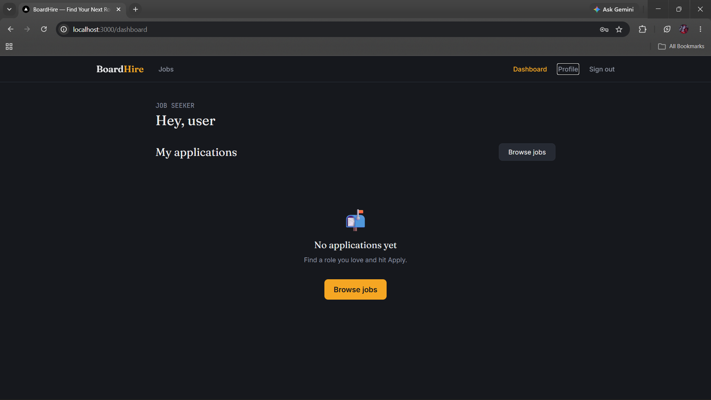
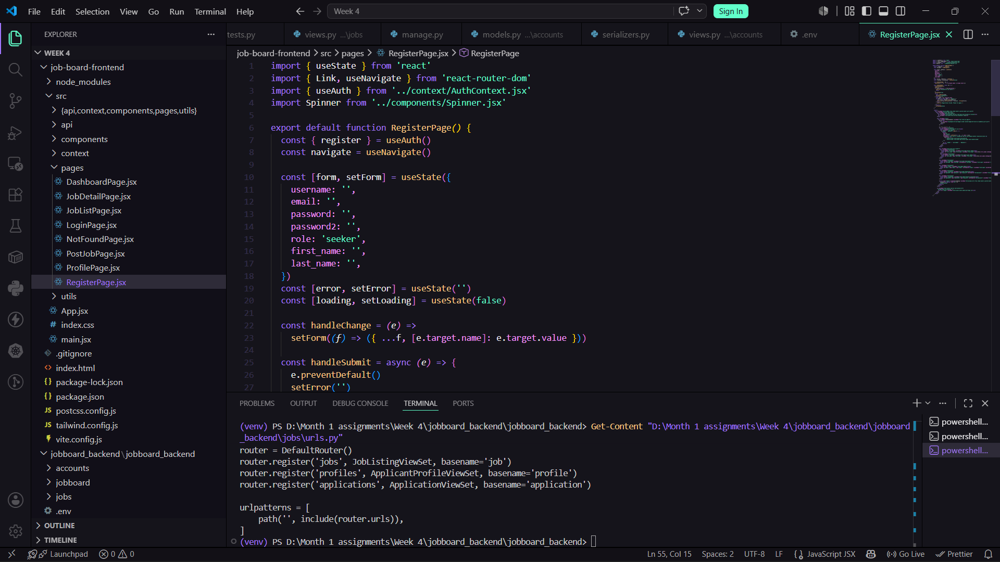
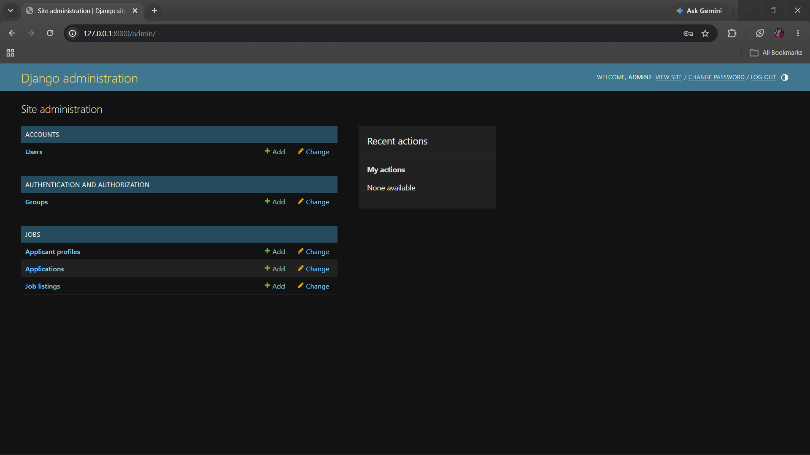

# BoardHire — Full Stack Job Board Platform

A full-stack job board application built with **Django REST Framework** (backend) and **React** (frontend). Supports two user roles — **Job Seekers** and **Employers** — with authentication, job postings, and applications.

## Features

- JWT-based authentication (register, login, refresh, current-user endpoint)
- Role-based permissions (Seeker vs Employer)
- Employers can create, update, and manage their own job postings
- Seekers can browse/filter active jobs (by location, type, title, salary) and apply
- Applicant profiles — headline, bio, skills, and resume upload
- Resume upload at application time too (per-application resume)
- Prevents duplicate applications from the same seeker
- Employers can view and update application status for their own jobs
- Unrelated users cannot view applications they don't own
- React Router with 7 pages and role-protected routes

## Tech Stack

**Backend:** Python 3.11+, Django 4.x, Django REST Framework, SimpleJWT, PostgreSQL (production), SQLite (in-memory, tests only)
**Frontend:** React, React Router, Axios

## Project Structure

```
Week 4/
├── jobboard_backend/
│   └── jobboard_backend/      # Django project
│       ├── jobboard/           # Settings, root URLs
│       ├── accounts/           # Custom User model, auth endpoints
│       ├── jobs/                # Job listings, applicant profiles, applications
│       ├── docs/                # Screenshots
│       ├── .env.example
│       └── manage.py
└── job-board-frontend/         # React app
    └── src/
        ├── api/                 # client.js, auth.js, jobs.js
        ├── context/             # AuthContext
        ├── components/          # Navbar, JobCard, ProtectedRoute, etc.
        └── pages/                # 7 pages (see below)
```

## Setup

### 1. Backend

```powershell
cd jobboard_backend\jobboard_backend
python -m venv venv
venv\Scripts\activate
pip install -r requirements.txt
```

### 2. Create the PostgreSQL database

Make sure PostgreSQL is installed and running, then create the database and user (adjust password to match your `.env`):

```sql
CREATE DATABASE jobboard;
```

### 3. Environment variables

Copy `.env.example` to `.env` and fill in your real values:

```powershell
copy .env.example .env
```

`.env.example`:
```
DJANGO_SECRET_KEY=change-me-to-a-long-random-string
DJANGO_DEBUG=True
DJANGO_ALLOWED_HOSTS=localhost,127.0.0.1

DB_NAME=jobboard
DB_USER=jobboard_user
DB_PASSWORD=changeme
DB_HOST=localhost
DB_PORT=5432

CORS_ALLOWED_ORIGINS=http://localhost:3000,http://127.0.0.1:3000
```

### 4. Run migrations and start the server

```powershell
python manage.py migrate
python manage.py createsuperuser
python manage.py runserver
```
API runs at `http://localhost:8000/api/` · Admin at `http://localhost:8000/admin/`

### 5. Frontend

```powershell
cd job-board-frontend
npm install
npm run dev
```
App runs at `http://localhost:3000`

## React Pages

| Route | Page | Access |
|---|---|---|
| `/` | Job listings + filters | Public |
| `/login` | Sign in | Public |
| `/register` | Register (seeker or employer) | Public |
| `/jobs/:id` | Job detail + apply | Public (apply requires login) |
| `/dashboard` | Seeker: application tracker · Employer: manage listings | Auth required |
| `/post-job`, `/post-job/:id` | Create / edit a job listing | Employer only |
| `/profile` | Edit headline, bio, skills, resume | Auth required |

## Testing

**16 automated tests, all passing** (minimum required: 5).

```powershell
pytest
```

```
collected 16 items
accounts/tests.py::TestRegistration::test_register_seeker_success PASSED
accounts/tests.py::TestRegistration::test_register_password_mismatch_fails PASSED
accounts/tests.py::TestRegistration::test_register_employer_requires_company_name PASSED
accounts/tests.py::TestLogin::test_login_success_returns_tokens_and_user PASSED
accounts/tests.py::TestLogin::test_login_wrong_password_fails PASSED
accounts/tests.py::TestLogin::test_me_requires_authentication PASSED
accounts/tests.py::TestLogin::test_me_returns_current_user PASSED
jobs/tests.py::TestJobListings::test_employer_can_create_job PASSED
jobs/tests.py::TestJobListings::test_seeker_cannot_create_job PASSED
jobs/tests.py::TestJobListings::test_anonymous_user_can_list_active_jobs PASSED
jobs/tests.py::TestJobListings::test_filter_jobs_by_location PASSED
jobs/tests.py::TestJobListings::test_other_employer_cannot_edit_job PASSED
jobs/tests.py::TestApplications::test_seeker_can_apply_to_job PASSED
jobs/tests.py::TestApplications::test_seeker_cannot_apply_twice_to_same_job PASSED
jobs/tests.py::TestApplications::test_employer_can_update_application_status PASSED
jobs/tests.py::TestApplications::test_unrelated_user_cannot_view_application PASSED

16 passed in 4.41s
```

## API Endpoints

### Authentication
| Method | Endpoint | Description |
|---|---|---|
| POST | `/api/auth/register/` | Register a new user (seeker or employer) |
| POST | `/api/auth/login/` | Login, get `access` + `refresh` JWT tokens |
| POST | `/api/auth/refresh/` | Refresh access token |
| GET | `/api/auth/me/` | Get current logged-in user |

### Jobs, profiles, and applications (full CRUD via DRF viewsets)
| Method | Endpoint | Description |
|---|---|---|
| GET | `/api/jobs/` | List active jobs (public; filterable) |
| POST | `/api/jobs/` | Create a job (employer only) |
| GET | `/api/jobs/<id>/` | Job detail |
| PATCH | `/api/jobs/<id>/` | Update a job (owner only) |
| DELETE | `/api/jobs/<id>/` | Delete a job (owner only) |
| GET | `/api/profiles/` | List/view applicant profiles |
| POST | `/api/profiles/` | Create your applicant profile (headline, bio, skills, resume) |
| PATCH | `/api/profiles/<id>/` | Update your profile |
| GET | `/api/applications/` | List your applications (seeker) or applications to your jobs (employer) |
| POST | `/api/applications/` | Apply to a job (seeker only — send `job`, `cover_letter`, optional `resume`) |
| PATCH | `/api/applications/<id>/` | Update application status (employer, on their own job's applications) |

### Filtering
```
GET /api/jobs/?location=austin
GET /api/jobs/?job_type=remote
GET /api/jobs/?title=engineer
GET /api/jobs/?salary_min=80000
GET /api/jobs/?search=django
GET /api/jobs/?ordering=-created_at
GET /api/applications/?status=reviewed
GET /api/applications/?job=3
```

## Screenshots





## Author
Keshav Raj Jain
Built as part of a Month 1 / Week 4 capstone assignment.
